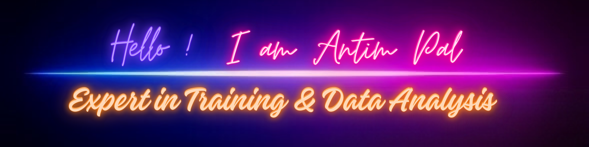

<!-- Banner Section-->
<div align="center">


</div>

<!--
<h1 align="center">
  
</h1>
-->
<!-- <h1 align="center">🏄‍♂️ Hi 👋, I'm Antim pal</h1> -->

<!-- adding name -->
<p align="center"><a href="#-github-trophies"></a></p>


<h1 align="center" > I'm a Training Specialist at IWP Academy⚡</h1>

<!-- banner that is have follower and youtube-->

<div align="center">
<a hraf="#">  </a>

<a href="#"> </a>
<a href="#"> </a>
<a href="#"> </a>
<a href="#"> </a>

</div>


<!-- My Discription-->
<h3 align="center" >I am qualified with foundational knowledge in statistical analysis, data cleaning, and data modeling techniques. Proficient in programming languages such as Python and SQL, I am eager to apply my skills to manipulate and analyze data effectively. I am passionate about learning and gaining experience in creating interactive dashboards and visualizations using tools like Power BI. My strong analytical and problem-solving abilities make me well-equipped to derive insights from complex datasets and contribute positively to data-driven decision-making processes.</h3>

<!-- Adding Follower and youtube option -->
<!-- 
<p align="center">
      <a href="https://www.youtube.com/@OptimismEducator?sub_confirmation=1">
         </a> 
      <a href="https://www.youtube.com/@OptimismEducator">
         </a> 
      <a href="https://github.com/iamAntimPal?tab=followers">
         </a>
      <a href="https://github.com/iamAntimPal?tab=repositories&sort=stargazers">
         </a>
   </p> -->

<!-- Antim Pal Summary -->


<!-- Gif Section -->
<!-- GIF -->
<!-- <br> -->

[](https://github.com/iamAntimPal?tab=repositories)

<!--  -->

<div>
 <h3 align="left">   About Me: </h3>

- 🏦 I'm a Data Analyst who worked for Intern Career startup in India 
      
- 🔭 I’m currently working on:- **Graphic Designer And Data Analytics Trainer**
- 🌱 I’m currently learning:- **Data Science Machine Learning**
- 👨‍💻 All of my projects are available at  [https://iamantimpal.github.io/Antim-Portfolio/](https://iamantimpal.github.io/Antim-Portfolio/)

- 💬 Ask me about:- **NumPy, pandas, Matplotlib, Seaborn, Power BI, C++, Python, Photoshop, Illustator, Indesign, MySql**

- 📫 How to reach me:- **antimpal01617121@gmail.com**
  
- 📫 Join Whatsapp Group:-  **https://chat.whatsapp.com/CDEWDYYKc0i2z1We9xwKfK** 

- ⚡ Fun fact: **My GitHub is more active then my phone!😂**
</div>
  
## 🧑‍💻 Tech I work on :


<p align="center"> <a href="https://www.w3schools.com/cpp/" target="_blank" rel="noreferrer"> 

<a href="https://www.w3schools.com/css/" target="_blank" rel="noreferrer">  </a> 
<a href="https://www.w3.org/html/" target="_blank" rel="noreferrer">  </a> 
<a href="https://www.java.com" target="_blank" rel="noreferrer"> 
 </a> <a href="https://mariadb.org/" target="_blank" rel="noreferrer"> 
 </a> <a href="https://www.mongodb.com/" target="_blank" rel="noreferrer">
 </a> <a href="https://www.microsoft.com/en-us/sql-server" target="_blank" rel="noreferrer"> 
 </a> <a href="https://www.mysql.com/" target="_blank" rel="noreferrer"> 
 </a> <a href="https://pandas.pydata.org/" target="_blank" rel="noreferrer"> 
 </a> <a href="https://www.postgresql.org" target="_blank" rel="noreferrer"> 
 </a> <a href="https://www.python.org" target="_blank" rel="noreferrer"> 
 </a> <a href="https://scikit-learn.org/" target="_blank" rel="noreferrer">
 </a> <a href="https://seaborn.pydata.org/" target="_blank" rel="noreferrer">  </a>
 


  
 
 
 
</p>

<!-- 🏆 GitHub Trophies -->

## 🏆 GitHub Trophies


<!-- Tech Stack -->

# 💻 Tech Stack:
                             

---
### 📺 Latest YouTube Videos
<!--
Lestest Video on Youtube -->

<!-- BEGIN YOUTUBE-CARDS -->

<!--[](https://www.youtube.com/watch?v=4Sj4-kYi0J0)
[](https://www.youtube.com/watch?v=yIwGl8YK18Y)
[](https://www.youtube.com/watch?v=T1hWCaC_N0Y)
[](https://www.youtube.com/watch?v=W13MloZg03Y)
[](https://www.youtube.com/watch?v=ZQyrrMqLT2s)
[](https://www.youtube.com/watch?v=CvooajyiiUw) -->


<!-- END YOUTUBE-CARDS -->

[](https://www.youtube.com/@OptimismEducator?sub_confirmation=1)

<!-- END YOUTUBE-CARDS End -->


##  My Github Stats:
<p align="center" >
  
<!-- this is adding github stats icon-->
<!-- ##  My Github Stats: -->

<a href="https://github.com/iamAntimPal#gh-dark-mode-only">

</a>

<!-- this try to git stats-->


 

</p>
<!-- the end of stats-->
<!-- This is for github stats-->


<!--  -->


<!-- Git hub stats -->

</div>

<!--  -->


## Top Repositories


<a href="https://github.com/iamAntimPal">
  
</a>
<a href="https://github.com/iamAntimPal/Hotel-Management">
  
</a>

---
 <details>	
    <summary><b>📈 Get my Code stats</b></summary><br>
<!--START_SECTION:waka-->


**I'm an Early 🐤** 

```text
🌞 Morning                1690 commits        ████████░░░░░░░░░░░░░░░░░   32.94 % 
🌆 Daytime                2078 commits        ██████████░░░░░░░░░░░░░░░   40.51 % 
🌃 Evening                869 commits         ████░░░░░░░░░░░░░░░░░░░░░   16.94 % 
🌙 Night                  493 commits         ██░░░░░░░░░░░░░░░░░░░░░░░   09.61 % 
```
📅 **I'm Most Productive on Friday** 

```text
Monday                   904 commits         ████░░░░░░░░░░░░░░░░░░░░░   17.62 % 
Tuesday                  1332 commits        ██████░░░░░░░░░░░░░░░░░░░   25.96 % 
Wednesday                1042 commits        █████░░░░░░░░░░░░░░░░░░░░   20.31 % 
Thursday                 328 commits         ██░░░░░░░░░░░░░░░░░░░░░░░   06.39 % 
Friday                   300 commits         █░░░░░░░░░░░░░░░░░░░░░░░░   05.85 % 
Saturday                 435 commits         ██░░░░░░░░░░░░░░░░░░░░░░░   08.48 % 
Sunday                   789 commits         ████░░░░░░░░░░░░░░░░░░░░░   15.38 % 
```


📊 **This Week I Spent My Time On** 

```text
🕑︎ Time Zone: Asia/Kolkata

💬 Programming Languages: 
Python                   16 hrs 10 mins      ████████████████████░░░░░   80.11 % 
CSS                      2 hrs 3 mins        ███░░░░░░░░░░░░░░░░░░░░░░   10.19 % 
C++                      1 hr 19 mins        ██░░░░░░░░░░░░░░░░░░░░░░░   06.53 % 
YAML                     14 mins             ░░░░░░░░░░░░░░░░░░░░░░░░░   01.22 % 
Other                    9 mins              ░░░░░░░░░░░░░░░░░░░░░░░░░   00.76 % 

🔥 Editors: 
VS Code                  20 hrs 11 mins      ███████████████████░░░░░░   82.00 % 

Jupyter Notebook          2 hrs 9 mins      ████░░░░░░░░░░░░░░░░░░░░░   18.00 % 


💻 Operating System: 
Windows                  50 hrs 11 mins      █████████████████████████   100.00 % 
```

**I Mostly Code in Python** 

```text
Python               35 repos            ███████████░░░░░░░░░░░░░░   45.65 % 
HTML                     8 repos             ████░░░░░░░░░░░░░░░░░░░░░   17.39 % 
CSS                      4 repos             ██░░░░░░░░░░░░░░░░░░░░░░░   08.70 % 
SQL                  3 repos             ██░░░░░░░░░░░░░░░░░░░░░░░   06.52 % 
Pandas                  1 repo              █░░░░░░░░░░░░░░░░░░░░░░░░   02.17 % 
```

<!--END_SECTION:waka-->
   </details> 


<!--START_SECTION:waka-->

 **Year Progress** { █████████████████████████▁▁▁▁▁▁▁▁▁ } 75.78 % as on ⏰ 15-March-2025

---
## Portfolio Website
[](https://iamantimpal.github.io/Antim-Portfolio/)
---

## Contact

<!-- My Gmail -->
  <a href="mailto:antimpal01617121@gmail.com">
  
</a>

<!-- LinkedIn Badge -->
<a href="https://www.linkedin.com/in/antim-pal/" target="_blank">
  
</a>

<!-- HackerRank Badge -->
<a href="https://www.hackerrank.com/profile/antimpal01617121/" target="_blank">
  
</a>

<!-- LeetCode Badge -->
<a href="https://leetcode.com/antim_pal/" target="_blank">
  
</a>

<!-- whatsapp group -->
<a href="https://chat.whatsapp.com/CDEWDYYKc0i2z1We9xwKfK" target="_blank">
  
</a>

<!-- [](https://github.com/anuraghazra/github-readme-stats) -->


<!--
---
<details>
<summary><h1>This is the main for me</h1></summary>
<p>ok that is Random for al to haide that ok!</p>

</details>
-->
<!-- Snake Game -->


<picture>
  <source media="(prefers-color-scheme: dark)" srcset="https://raw.githubusercontent.com/iamAntimPal/iamAntimPal/output/github-snake-dark.svg" />
  <source media="(prefers-color-scheme: light)" srcset="https://raw.githubusercontent.com/iamAntimPal/iamAntimPal/output/github-snake.svg" />
  
</picture>


###  My Latest Blog posts:

<!-- Visiter count -->
<div align="center" style="font-family: 'Segoe UI', Tahoma, Geneva, Verdana, sans-serif;">
  <p>Visitor Count</p>
  
</div>

<!-- Keep Learing Banner -->

<p align="center">
<a href="https://github.com/JurojinKun?tab=repositories">

</a>
</p>

<!-- Profile End -->

---


<p align="center">
  
</p>

<!-- now complete -->
<!-- Profile End -->
